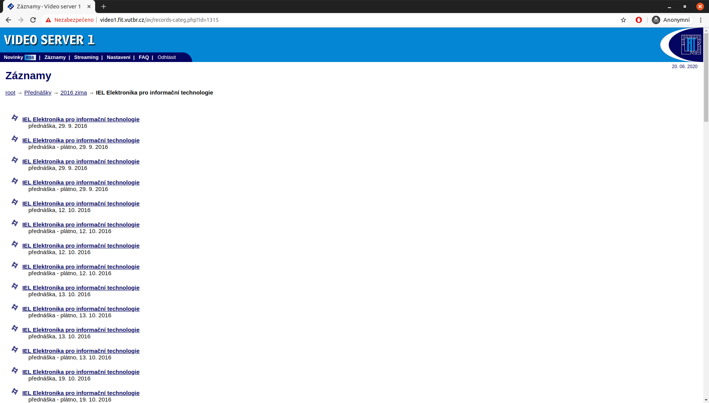
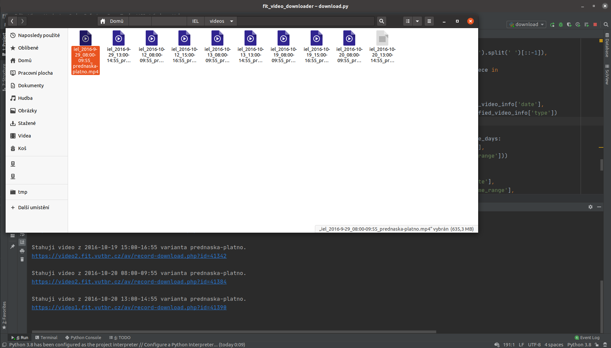

### Stahovátko přednášek
Pokud jste někdy uvažovali nad zálohou záznamů z celého předmětu na FIT VUT, patrně vás otrávila nemožnost stáhnout je 
všechny a při jednotlivém stahování problémy s certifikáty a stejná jména souborů, která přepisují dříve stažená videa. 
Při prokrastinaci u učení ke státnicím jsem nabastlil jednoduchý skript, kterému se zadá URL stránky se seznamem videí 
pro daný předmět a semestr a videa se po jednom stáhnou.

## Omezení
Při stahování je možné se setkat s limitem počtu stažení videí na den, který je poměrně malý. V době vzniku to bylo 30 
videí na den patrně pod jedním loginem (různé IP nemají vliv). Dále se může stát, že není možné stáhnout konkrétní 
video, pokud bylo jeho stahování zadáno více než dvakrát v posledních 10 minutách. V obou případech se objeví hlášení o 
nemožnosti video stáhnout. Zároveň se dá předmět v semestru stahovat opakovaně, pokud nějaká videa z důvodu dosažení 
limitů chybí, existující videa se znovu nestahují.

## Spouštění
V základu se skriptu pomocí programových argumentů předává username a heslo do WISu, URL se seznamem odkazů na videa z 
předmětu a cesta do adresáře, kde mají být videa stažena. Nepovinnými argumenty je možné nastavit požadovaný typ 
přednášek, je možné vybírat mezi plátnem, pohledem na kantora nebo oběma variantama. Jako druhá je možnost stahovat 
jenom jedno video z konkrétního nahrávacího dne, což se hodí v případě, že ten samí den pozděj byla přednáška pro 
druhou skupinu studentů.
```bash
python3 download.py -u xlogin00 \
-p password \
--video-url https://video1.fit.vutbr.cz/av/records-categ.php?id=1315 \
--video-dir /home/user/Documents/iel \
--video-type board
```



## Licence
Zcela volné použití. Nepsal jsem to s nijak velkou péčí, předpokládám, že to použiju ve velkém tak jednou. Takže pokud 
máte chuť to použít, vylepšit, cokoliv s chutí do toho.